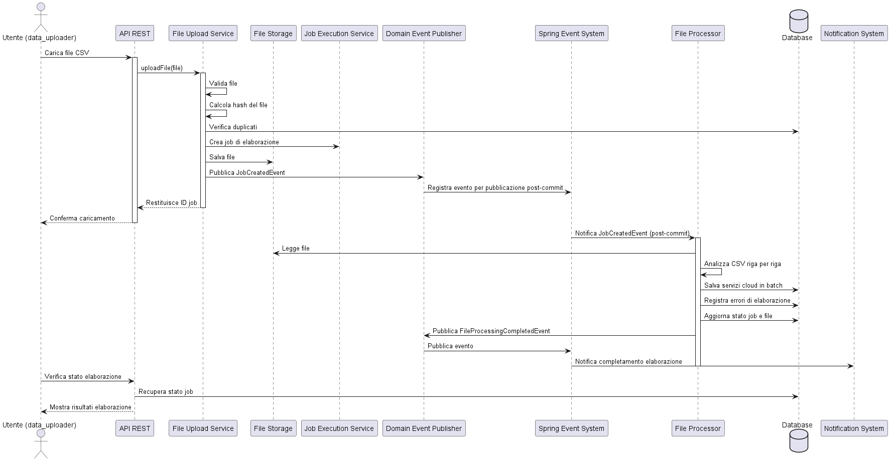
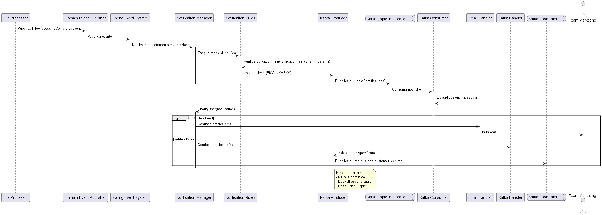
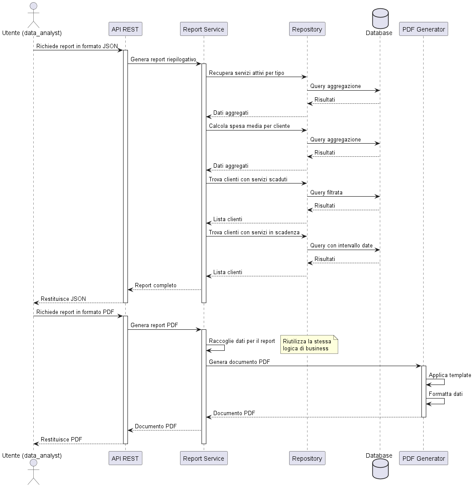
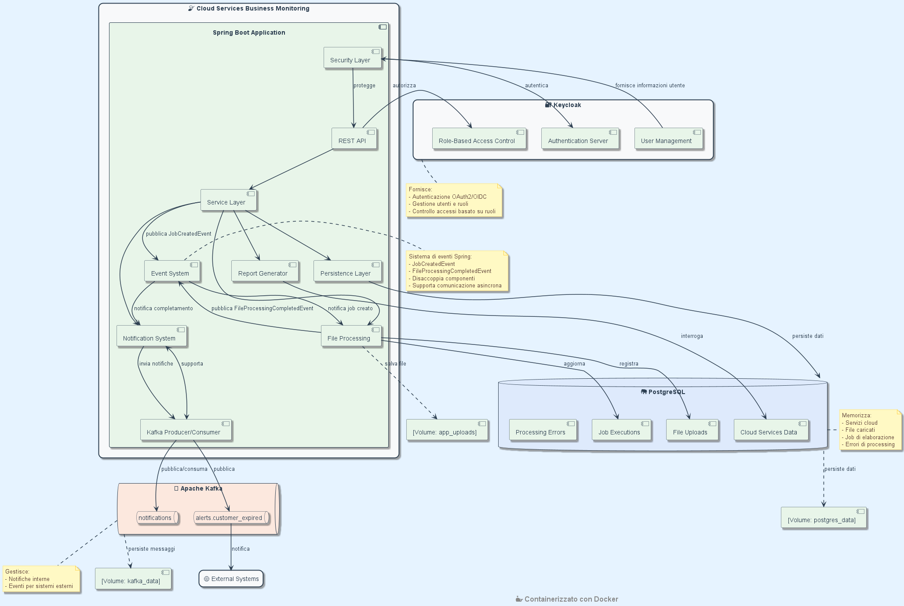
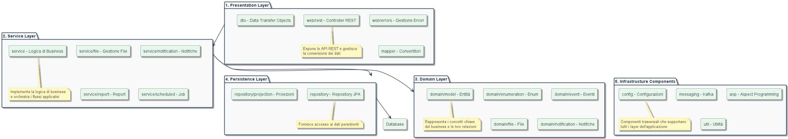
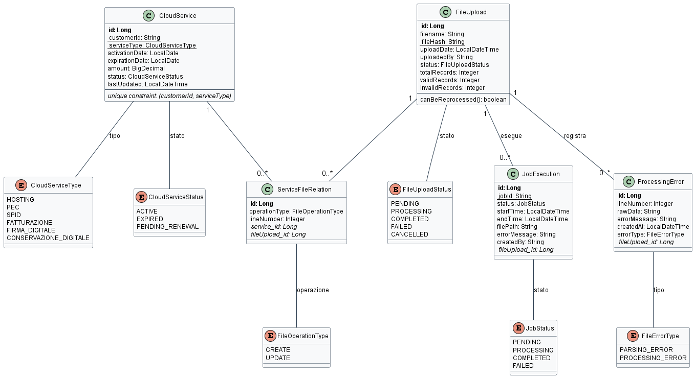

<h1 align="center" style="font-size: 4em; margin-bottom: 5px;">Cloud Services Business Monitoring</h1>
<p align="center" style="font-size: 1em;"><em>Una piattaforma per il caricamento, l'elaborazione e il monitoraggio dei servizi cloud aziendali.</em></p>
<p align="center">
  
  
  
</p>

## Indice
1. [Introduzione](#introduzione)
    - [Overview del Sistema](#overview-del-sistema)
    - [Casi d'uso principali](#casi-duso-principali)
2. [Aspetti Funzionali](#aspetti-funzionali)
    - [Caricamento ed Elaborazione dei Dati](#caricamento-ed-elaborazione-dei-dati)
    - [Sistema di Notifiche](#sistema-di-notifiche)
    - [Generazione Report](#generazione-report)
3. [Aspetti Architetturali](#aspetti-architetturali)
    - [Architettura di Sistema - High Level Design](#architettura-di-sistema---high-level-design)
    - [Architettura Software dell'Applicazione](#architettura-software-dellapplicazione)
    - [Pattern di Comunicazione](#pattern-di-comunicazione)
    - [Design Pattern Utilizzati](#design-pattern-utilizzati)
    - [Persistenza dei Dati](#persistenza-dei-dati)
    - [Sicurezza](#sicurezza)
    - [Progettazione delle API](#progettazione-delle-api)
    - [Considerazioni sulla Scalabilità](#considerazioni-sulla-scalabilità)
4. [Domain Model](#domain-model)
5. [Struttura del Progetto](#struttura-del-progetto)
6. [Setup e Utilizzo](#setup-e-utilizzo)
    - [Prerequisiti](#prerequisiti)
    - [Avvio dell'applicazione](#avvio-dellapplicazione)
    - [Accedi all'applicazione: servizi disponibili](#servizi-disponibili)
    - [Autenticazione con Keycloak](#autenticazione-con-keycloak)
7. [Documentazione API](#documentazione-api)
    - [Swagger UI](#swagger-ui)
    - [Formati File Supportati per l'upload](#formati-file-supportati-per-lupload)
    - [Ruoli e Permessi](#ruoli-e-permessi)
8. [Testing](#testing)
9. [Troubleshooting](#troubleshooting)


## Introduzione
Cloud Services Business Monitoring è una piattaforma sviluppata per analizzare e monitorare l'utilizzo dei servizi cloud da parte dei clienti aziendali. 


### Overview del Sistema

Il sistema consente di caricare file CSV contenenti informazioni dettagliate sui servizi cloud acquistati dai clienti business. Questi dati vengono elaborati attraverso una pipeline che:
1. Valida i dati in ingresso, garantendo l'integrità delle informazioni
2. Analizza i pattern di utilizzo e identifica potenziali anomalie
3. Genera report riepilogativi con metriche chiave di business
4. Invia notifiche asincrone quando vengono rilevate condizioni particolari

La piattaforma è stata progettata con un'architettura scalabile e resiliente, utilizzando tecnologie moderne come Spring Boot, Apache Kafka, Postgresql e Keycloak per garantire sicurezza, affidabilità e prestazioni elevate.

### Casi d'uso principali

- Analisi periodica dei dati di utilizzo: Gli analisti possono accedere a report aggregati che mostrano statistiche chiave come la distribuzione dei servizi attivi, la spesa media per cliente, e l'identificazione di servizi in scadenza.
- Monitoraggio pro-attivo: Il sistema identifica automaticamente clienti con servizi scaduti o in scadenza, permettendo interventi tempestivi da parte del team commerciale.
- Identificazione opportunità di business: Attraverso l'analisi dei pattern di utilizzo, il sistema segnala potenziali opportunità di upselling, come clienti con servizi attivi da lungo tempo.
- Gestione delle anomalie: Quando vengono rilevate condizioni particolari (come clienti con numerosi servizi scaduti), il sistema genera notifiche asincrone che vengono instradate ai team appropriati.


## Aspetti Funzionali

Flussi Applicativi Principali

### Caricamento ed Elaborazione dei Dati



 1. **Caricamento del file**
    - L'utente con ruolo `data_uploader` carica un file CSV tramite l'API REST
    - Il sistema valida il formato e la struttura del file
    - Viene calcolato un hash univoco del file per identificare eventuali duplicati
    - Se il file è valido, viene salvato nel filesystem e viene creato un job di elaborazione
    - L'utente riceve immediatamente una conferma con l'ID del job, senza dover attendere l'elaborazione completa

 2. **Elaborazione asincrona**
    - Il sistema pubblica un evento JobCreatedEvent tramite il meccanismo di eventi di Spring
    - L'evento viene pubblicato in modo transazionale, garantendo che venga processato solo dopo il commit della transazione
    - Questo approccio disaccoppia il caricamento dall'elaborazione, offrendo diversi vantaggi:
      - L'utente non deve attendere il completamento dell'elaborazione di file potenzialmente grandi
      - Il sistema può gestire più elaborazioni contemporaneamente, ottimizzando le risorse
      - I picchi di carico vengono gestiti in modo efficiente attraverso il sistema di eventi

 3. **Processing del file**
    - Il File Processor riceve l'evento e avvia l'elaborazione del file
    - Il file viene letto riga per riga in modo efficiente, senza caricare l'intero file in memoria
    - Ogni record viene validato e trasformato in un oggetto di dominio
    - I dati validi vengono salvati nel database come servizi cloud
    - Gli errori di formato o contenuto vengono registrati ma non bloccano l'elaborazione degli altri record
 
4. **Resilienza e ottimizzazione delle risorse**
   - Il sistema elabora i record in batch offrendo importanti vantaggi:
     - Riduzione del carico sul database evitando transazioni troppo grandi
     - Utilizzo efficiente della memoria anche con file di dimensioni elevate
     - Garanzia che i dati già elaborati vengano salvati anche in caso di errori nei record successivi
   - L'utente può verificare lo stato dell'elaborazione in qualsiasi momento tramite l'API
   - Al completamento dell'elaborazione, viene pubblicato un evento che avvia automaticamente e in maniera asincrona il processo di notifica

5. **Recupero automatico da errori**
    - Il sistema implementa un meccanismo di retry automatico tramite `FileProcessingRetryService`
    - Questo servizio schedulato verifica periodicamente i job falliti e li ripristina allo stato PENDING
    - I job vengono quindi rielaborati automaticamente, permettendo di recuperare da errori temporanei
    - Questo approccio aumenta la resilienza del sistema senza richiedere intervento manuale
   
Questo approccio basato su eventi garantisce un'architettura bassamente accoppiata, dove i componenti comunicano in modo asincrono attraverso il sistema di eventi di Spring, migliorando la scalabilità e la manutenibilità dell'applicazione.


### Sistema di Notifiche



 1. **Rilevamento condizioni e generazione notifiche**
    - Al completamento dell'elaborazione di un file, viene pubblicato un evento FileProcessingCompletedEvent tramite il sistema di eventi di Spring
    - Il Notification Manager riceve l'evento e avvia l'analisi dei dati elaborati in modo asincrono
    - Diverse regole di notifica vengono applicate per identificare condizioni particolari:
      - ExpiredServicesNotificationRule: Identifica clienti con più di 5 servizi scaduti
      - ActiveServiceOlderThanNotificationRule: Identifica servizi attivi da oltre 3 anni (opportunità di upselling)

 2. **Gestione asincrona delle notifiche**
    - Quando una regola rileva una condizione, crea una notifica appropriata (tipo EMAIL o KAFKA)
    - Tutte le notifiche vengono pubblicate sul topic Kafka "notifications" tramite il KafkaNotificationHandler
    - Un KafkaConsumer dedicato è costantemente in ascolto su questo topic per elaborare le notifiche in modo asincrono
    - Questo approccio a due livelli (eventi Spring + Kafka) garantisce:
      - Disaccoppiamento completo tra i componenti del sistema
      - Elaborazione asincrona e resiliente delle notifiche
      - Scalabilità in caso di picchi di carico

 3. **Elaborazione delle notifiche**
    - Un consumer Kafka dedicato ascolta il topic "notifications"
    - Per ogni messaggio ricevuto, implementa un meccanismo di deduplicazione per evitare elaborazioni multiple
    - In base al tipo di notifica, il Notification Manager seleziona l'handler appropriato:
      - Le notifiche di tipo EMAIL vengono inviate via email al team marketing
      - Le notifiche di tipo KAFKA vengono inoltrate al topic "alerts.customer_expired" per sistemi esterni

 4. **Resilienza e affidabilità**
    - Il sistema implementa diversi meccanismi per garantire l'affidabilità:
      - Deduplicazione dei messaggi utilizzando cache Caffeine per evitare elaborazioni multiple
      - Generazione di hash MD5 univoci basati sul contenuto delle notifiche per l'identificazione dei duplicati
      - Retry automatico con backoff esponenziale in caso di errori temporanei
      - Routing verso dead letter topic per le notifiche che falliscono ripetutamente
      - Transazioni separate per ogni fase del processo

 Questa architettura a eventi garantisce un sistema di notifiche scalabile e resiliente. 
 Il disaccoppiamento tra la generazione e l'elaborazione delle notifiche permette al sistema principale 
 di continuare a funzionare anche in caso di problemi nel sottosistema di notifica.

### Generazione Report



 1. **Richiesta del report in formato JSON**
    - L'utente con ruolo di analista dati richiede un report riepilogativo tramite l'API

 2. **Raccolta e aggregazione dei dati**
    - Il sistema esegue diverse query ottimizzate per raccogliere:
        - Statistiche sui servizi attivi per ciascuna tipologia
        - Informazioni sulla spesa media per cliente
        - Elenco dei clienti con più servizi scaduti
        - Elenco dei clienti con servizi in scadenza nei prossimi 15 giorni
    - I dati vengono aggregati direttamente dal database per massimizzare l'efficienza

 3. **Restituzione del report JSON**
    - Il sistema assembla tutte le informazioni raccolte in un report strutturato
    - 'API restituisce il report in formato JSON all'utente
 
 4. **Restituzione del report PDF**
    - L'utente può richiedere lo stesso report in formato PDF tramite un endpoint dedicato
 
 5. **Generazione del PDF**
    - Il sistema raccoglie gli stessi dati utilizzati per il report JSON
    - Viene applicato un template grafico predefinito implementato con Jasper Report per formattare le informazioni
    - L'utente riceve il file PDF


# Aspetti Architetturali

## Architettura di Sistema - High Level Design



L'architettura di **Cloud Services Business Monitoring** è stata progettata come un sistema containerizzato completo, 
orchestrato tramite **Docker**, che integra diverse tecnologie per fornire una soluzione robusta e scalabile per il 
monitoraggio dei servizi cloud aziendali.

Al centro dell'architettura si trova l'applicazione Spring Boot, organizzata in componenti funzionali ben definiti che 
collaborano attraverso interfacce chiare. Il layer di presentazione espone API REST protette dal componente di sicurezza, 
mentre il Service Layer orchestra la logica di business. L'elaborazione dei file, la generazione di report e la gestione 
delle notifiche sono implementate come componenti specializzati che interagiscono con il layer di persistenza per 
l'accesso ai dati.

La comunicazione interna tra i componenti avviene principalmente attraverso il sistema di eventi di Spring, che permette 
un disaccoppiamento efficace. Eventi come `JobCreatedEvent` e `FileProcessingCompletedEvent` consentono l'elaborazione 
asincrona dei file e la generazione di notifiche senza bloccare il flusso principale dell'applicazione.

Per la persistenza dei dati, il sistema utilizza **PostgreSQL**, che memorizza informazioni sui servizi cloud, file caricati, 
job di elaborazione ed errori. I dati sono conservati in un volume Docker dedicato (`postgres_data`) per garantirne la 
durabilità anche in caso di riavvio dei container.

La comunicazione asincrona con sistemi esterni e la gestione delle notifiche sono implementate tramite **Apache Kafka**, che 
fornisce due topic principali: `notifications` per la gestione interna delle notifiche e `alerts.customer_expired` per 
la pubblicazione di eventi destinati a sistemi esterni. Anche Kafka utilizza un volume dedicato (`kafka_data`) per 
garantire la persistenza dei messaggi.

La sicurezza è gestita tramite **Keycloak**, che fornisce autenticazione OAuth2/OpenID Connect, gestione centralizzata degli 
utenti e controllo degli accessi basato su ruoli. Questo garantisce che solo gli utenti autorizzati possano accedere 
alle funzionalità del sistema in base ai loro ruoli specifici.

I file caricati dagli utenti vengono elaborati e archiviati in un volume Docker dedicato 
(`app_uploads`), garantendo la persistenza dei dati anche in caso di riavvio dell'applicazione.

Questa architettura containerizzata offre numerosi vantaggi: facilità di deployment, isolamento dei componenti, 
scalabilità e portabilità tra diversi ambienti. L'approccio basato su eventi e messaggistica asincrona garantisce 
inoltre resilienza e reattività del sistema anche sotto carico elevato o in presenza di operazioni di lunga durata.

## Architettura Software dell'Applicazione

**Cloud Services Business Monitoring** è stato implementato come un'applicazione monolitica moderna, una scelta architetturale che offre diversi vantaggi per questo specifico contesto applicativo:
- Semplicità di sviluppo e deployment: Un unico code base facilita lo sviluppo, il testing e il deployment
- Comunicazione efficiente tra componenti: I moduli interni comunicano direttamente senza overhead di rete
- Integrità dei dati: Garanzia di coerenza attraverso transazioni ACID in un unico database, eliminando la complessità della gestione di transazioni distribuite
- Ridotta complessità operativa: Un singolo servizio da monitorare e scalare

Nonostante l'approccio monolitico, l'architettura interna è stata progettata con una chiara separazione delle responsabilità e modularità, permettendo una potenziale evoluzione verso microservizi in futuro, se necessario.

## Architettura a Layer
L'applicazione segue un'architettura a layer ben definita che separa le diverse responsabilità:

<p align="center">
  <a href="docs/diagrams/images/sw_architecture.png" target="_blank">
    
  </a>
  <br>
  <em>Clicca sull'immagine per visualizzarla a dimensione piena</em>
</p>

### 1. Presentation Layer
- **web/rest**: Controller REST che espongono le API HTTP
- **web/errors**: Gestione centralizzata degli errori HTTP
- **dto**: Data Transfer Objects per l'interfaccia esterna
- **mapper**: Convertitori tra DTO e oggetti di dominio

### 2. Service Layer
- **service**: Implementazione della logica di business e orchestrazione dei flussi applicativi
    - **service/file**: Gestione dei file caricati
    - **service/notification**: Elaborazione e invio delle notifiche
    - **service/report**: Generazione dei report
    - **service/scheduled**: Job schedulati per operazioni periodiche come il recupero dei job falliti per il reprocessing automatico

### 3. Domain Layer
- **domain/model**: Entità di dominio che rappresentano i concetti chiave del business
- **domain/enumeration**: Tipi enumerati per valori di dominio
- **domain/event**: Eventi di dominio per la comunicazione tra componenti
- **domain/file**: Modelli specifici per la gestione dei file
- **domain/notification**: Modelli per il sistema di notifiche

### 4. Persistence Layer
- **repository**: Repository JPA per l'accesso ai dati
- **repository/projection**: Proiezioni per query ottimizzate

### 5. Infrastructure Components
- **config**: Configurazioni dell'applicazione e dei servizi esterni
    - **config/async**: Configurazione per l'elaborazione asincrona
    - **config/properties**: Proprietà applicative
    - **config/security**: Configurazione di sicurezza e integrazione con Keycloak
- **messaging**: Integrazione con Apache Kafka (producer e consumer)
- **aop**: Programmazione orientata agli aspetti
    - **aop/logging**: Aspetti per il logging trasversale
- **util**: Classi di utilità condivise

## Pattern di Comunicazione
L'applicazione implementa due principali pattern di comunicazione:

**Comunicazione Sincrona (REST)**
 - **API RESTful**: Interfaccia HTTP per interazioni sincrone con client esterni
 - **Risposte immediate**: Le richieste client ricevono una risposta diretta dal server
 - **Accoppiamento temporale**: Client e server devono essere disponibili contemporaneamente

**Comunicazione Asincrona (Messaggistica)**
 - **Eventi di Dominio**: Utilizzo di eventi Spring per il disaccoppiamento interno dei componenti
 - **Apache Kafka**: Utilizzato in due modalità distinte:
   - Message Queue: Per la gestione delle notifiche interne, con un consumer dedicato che processa i messaggi dal topic "notifications"
   - Event Streaming: Per la pubblicazione di eventi esterni sul topic "alerts.customer_expired" destinati ad altri sistemi

Questo approccio ibrido consente di mantenere l'interfaccia utente reattiva anche durante operazioni lunghe, 
disaccoppiare i componenti del sistema per una migliore manutenibilità, e garantire la resilienza attraverso la 
persistenza dei messaggi

## Design Pattern Utilizzati
L'applicazione implementa numerosi design pattern per migliorare la manutenibilità, l'estensibilità e la robustezza del codice:

- **Pattern Strutturali**
    - **Repository Pattern**: Astrazione per l'accesso ai dati persistenti
    - **DTO Pattern**: Separazione tra modelli di dominio e interfacce esterne
    - **Facade Pattern**: Servizi che semplificano l'accesso a sottosistemi complessi

- **Pattern Comportamentali**
    - **Strategy Pattern**: Implementato per la selezione dinamica dei parser di file e degli handler di notifica
    - **Observer Pattern**: Utilizzato attraverso il sistema di eventi di Spring per la comunicazione asincrona

- **Pattern Creazionali**
    - **Factory Method**: Utilizzato per la creazione di notifiche specifiche
    - **Builder Pattern**: Implementato per la costruzione di oggetti complessi (es. DTO, entità)

- **Altri Pattern**
    - **Dependency Injection**: Utilizzato estensivamente attraverso Spring Framework
    - **Retry Pattern**: Applicato per la gestione dei tentativi di invio delle notifiche, e per il recupero automatico dei job di elaborazione falliti
    - **Batch Processing**: Utilizzato nell'elaborazione dei file per ottimizzare le risorse

## Persistenza dei Dati
Il sistema utilizza un approccio strutturato per la persistenza dei dati:

- **Pattern Repository**: Fornisce un'astrazione di alto livello per l'accesso ai dati, nascondendo i dettagli dell'implementazione
- **Spring Data JPA**: Semplifica l'implementazione dei repository con generazione automatica delle query
- **Hibernate ORM**: Gestisce il mapping oggetto-relazionale tra le entità Java e le tabelle del database
- **Liquibase**: Gestisce l'evoluzione dello schema del database in modo controllato e versionato
- **Query ottimizzate**: Utilizzo di proiezioni e query specifiche per migliorare le prestazioni
- **Caching**: Utilizzo di Caffeine come provider di cache in-memory per ottimizzare le prestazioni, in particolare per la deduplicazione dei messaggi nel sistema di notifiche

## Sicurezza
La sicurezza dell'applicazione è implementata attraverso:

- **Keycloak**: Server di gestione identità e accessi che fornisce:
  - Autenticazione centralizzata
  - Gestione utenti e ruoli
  - Supporto per protocolli standard (OAuth 2.0, OpenID Connect)

- **Spring Security**: Integrato con Keycloak per:
  - Protezione degli endpoint REST
  - Autorizzazione basata su ruoli
  - Validazione dei token JWT
  - Sicurezza a livello di metodo con annotazioni (@PreAuthorize)

### Modello di controllo accessi basato su ruoli (RBAC)
Il sistema implementa un modello RBAC con i seguenti ruoli predefiniti:
  1. `admin` - Utente con accesso completo al sistema 
     - Ruoli assegnati: `admin`, `data_analyst`, `data_uploader`
     - Accesso a tutte le funzionalità dell'applicazione
  2. `uploader` - Utente dedicato al caricamento dei dati
     - Ruolo assegnato: `data_uploader`
     - Può caricare file CSV e monitorare lo stato dell'elaborazione
  3. `analyst` - Utente dedicato all'analisi dei dati
     - Ruolo assegnato: `data_analyst`
     - Può generare e visualizzare report

### Matrice di Autorizzazioni

La tabella seguente mostra quali operazioni possono essere eseguite da ciascun tipo di utente:
<table> 
    <thead> 
        <tr> 
            <th>Funzionalità</th> 
            <th>Endpoint</th> 
            <th>admin</th> 
            <th>analyst</th> 
            <th>uploader</th> 
        </tr> 
    </thead> 
    <tbody> 
        <tr> 
            <td colspan="5"><strong>Cloud Services</strong></td> 
        </tr> 
        <tr> 
            <td>Visualizzare tutti i servizi cloud di un cliente</td> 
            <td>GET /v1/cloud-services/customer/{customerId}</td> 
            <td>✅</td> <td>❌</td> <td>❌</td> 
        </tr> 
        <tr> 
            <td>Visualizzare un servizio cloud specifico di un cliente</td> 
            <td>GET /v1/cloud-services/service/{serviceType}/customer/{customerId}</td> 
            <td>✅</td> <td>❌</td> <td>❌</td> 
        </tr> 
        <tr> 
            <td colspan="5"><strong>File Upload</strong></td> 
        </tr> 
        <tr> 
            <td>Caricare un nuovo file CSV</td> 
            <td>POST /v1/files/upload</td> 
            <td>✅</td> <td>❌</td> <td>✅</td> </tr> 
        <tr> 
            <td>Visualizzare informazioni su un file caricato</td> 
            <td>GET /v1/files/{fileHash}</td> 
            <td>✅</td> <td>❌</td> <td>✅</td> 
        </tr> 
        <tr> 
            <td colspan="5"><strong>Job Management</strong></td> 
        </tr> 
        <tr> 
            <td>Visualizzare lo stato di un job</td> 
            <td>GET /v1/jobs/{jobId}</td> 
            <td>✅</td> <td>❌</td> <td>✅</td> 
        </tr> 
        <tr> 
            <td>Visualizzare tutti i job associati a un file</td> 
            <td>GET /v1/jobs/file/{fileHash}</td> 
            <td>✅</td> <td>❌</td> <td>✅</td> 
        </tr> 
        <tr> 
            <td colspan="5"><strong>Report</strong></td> 
        </tr> 
        <tr> 
            <td>Generare report di riepilogo in formato JSON</td> 
            <td>GET /v1/report/summary</td> <td>✅</td> <td>✅</td> <td>❌</td> 
        </tr> 
        <tr> 
            <td>Generare report di riepilogo in formato PDF</td> 
            <td>GET /v1/report/summary/pdf</td> 
            <td>✅</td> <td>✅</td> <td>❌</td> 
        </tr> 
    </tbody>
</table>

## Progettazione delle API
 
Il **versioning** dell'API è stato implementato direttamente nel path URL (/v1/...), permettendo un'evoluzione 
controllata dell'interfaccia senza impattare i client esistenti.

Per la documentazione è stato adottato **OpenAPI** con **Swagger UI**, creando una risorsa interattiva che evolve con il codice. 
Ogni endpoint è descritto in dettaglio, con esempi e informazioni sui possibili stati di risposta, facilitando 
l'integrazione e il testing.

Particolare attenzione è stata posta alla coerenza delle risposte, adottando una struttura uniforme con campi standard 
come success, message e data. Questo semplifica la gestione degli errori e il parsing delle risposte da parte dei client.

## Considerazioni sulla Scalabilità
Nonostante l'architettura monolitica, il sistema è stato progettato con attenzione alla scalabilità:
- Elaborazione asincrona: Operazioni intensive come l'elaborazione dei file e l'invio di notifiche avvengono in modo asincrono
- Batch processing: I dati vengono elaborati in batch per ottimizzare l'utilizzo delle risorse
- Caching: Implementato per ridurre il carico sul database per operazioni frequenti
- Containerizzazione: L'applicazione è containerizzata con Docker per facilitare il deployment e la scalabilità orizzontale
- Configurazione esternalizzata: Parametri chiave sono configurabili esternamente per adattarsi a diversi ambienti


## Domain Model




Il domain model dell'applicazione è stato progettato per rappresentare in modo efficace i concetti chiave del business: 
servizi cloud, file caricati, job di elaborazione ed errori.

L'entità centrale `CloudService` rappresenta i servizi cloud utilizzati dai clienti, con attributi che ne descrivono le 
caratteristiche fondamentali come tipo di servizio, date di attivazione e scadenza, importo e stato.
Un aspetto fondamentale di questa entità è il vincolo di unicità sulla combinazione di `customerId` e `serviceType`, 
che garantisce che ogni cliente possa avere al massimo un servizio di ciascun tipo. 
Questo vincolo riflette la regola di business secondo cui un cliente non può sottoscrivere più volte lo stesso tipo di 
servizio contemporaneamente.
Ogni servizio è associato ai file da cui è stato creato o aggiornato attraverso la relazione `ServiceFileRelation`, 
che mantiene anche informazioni sul tipo di operazione eseguita.

I file caricati sono rappresentati dall'entità `FileUpload`, che tiene traccia non solo delle informazioni di base come 
nome e hash del file, ma anche di metadati importanti come l'utente che ha effettuato il caricamento, la data e lo stato 
di elaborazione. Il campo `fileHash`, con vincolo di unicità, svolge un ruolo cruciale nel prevenire il caricamento di 
file duplicati. L'entità `FileUpload` è in relazione con i servizi cloud, gli errori riscontrati durante l'elaborazione 
e i job eseguiti.

L'elaborazione asincrona è gestita attraverso l'entità `JobExecution`, che rappresenta un job con un 
ciclo di vita ben definito, tracciando tempi di inizio e fine, stato di avanzamento ed eventuali errori.
Ogni job è identificato da un `jobId` univoco che permette di tracciare e riferire l'esecuzione in modo non ambiguo 
attraverso tutto il sistema.
Ogni job è associato a un file specifico in modo da garantire la tracciabilità completa del processo.

Infine l'entità `ProcessingError` permette di registrare gli errori riscontrati durante l'elaborazione dei file, 
memorizzando informazioni come il numero di riga, la riga stessa e il messaggio di errore, facilitando così la diagnosi 
e la risoluzione dei problemi.


## Struttura del Progetto

```
cloud-services-business-monitoring/
├── src/
│   ├── main/
│   │   ├── java/com/cimparato/csbm/
│   │   │   ├── aop/                     # aspect object programming
│   │   │   |   ├── logging/             # aop per logging
│   │   │   ├── config/                  # configurazioni
│   │   │   |   ├── async/               
│   │   │   |   ├── properties/          # proprietà applicative
│   │   │   |   ├── security/          
│   │   │   ├── domain/                  # dominio
│   │   │   |   ├── enumeration/
│   │   │   |   ├── event/
│   │   │   |   ├── file/
│   │   │   |   ├── model/
│   │   │   |   ├── notification/
|   |   |   ├── dto/                     # data transfer objects
│   │   │   |   ├── cloudService/
│   │   │   |   ├── fileupload/
│   │   │   |   ├── jobexecution/
│   │   │   |   ├── notification/
│   │   │   |   ├── processingerror/
│   │   │   |   ├── report/
│   │   │   ├── mapper/                  # mappers
│   │   │   ├── messaging/               # Kafka producers/consumers
│   │   │   ├── repository/              # JPA repository
│   │   │   |   ├── projection/          # proiezioni
│   │   │   ├── service/                 # logica di business
│   │   │   |   ├── file/                # gestione dei file caricati
│   │   │   |   ├── notification/        # gestione delle notifiche
│   │   │   |   ├── report/              # gestione dei report
│   │   │   |   ├── scheduled/           # job schedulati
│   │   │   ├── util/                    # classi di utilità
│   │   │   ├── web/                     
│   │   │   |   ├── errors/              # eccezioni e global handler
│   │   │   |   ├── rest/                # REST API endpoints
│   │   │   └── CloudServicesBusinessMonitoringApplication.java
│   │   └── resources/                   # risorse
│   │       ├── config                   # configurationi
|   │       │   ├── liquibase/changelog/ # script liquibase per DB
│   │       ├── reports                  # template jrxml per reports
│   │       ├── application-docker       # configurazione applicazione profilo docker
│   │       └── application.yml          # configurazione applicazione
│   └── test/
|       ├── java/com/cimparato/csbm/
|       │   ├── config/                  # configurazioni per i test
|       │   ├── domain/                   
|       │   ├── dto/                      
|       │   ├── mapper/                   
|       │   ├── messaging/               # test per producer/consumer Kafka
|       │   ├── repository/               
|       │   ├── service/                 # test per i servizi
|       │   │   ├── file/                # test per la gestione dei file
|       │   │   ├── notification/        # test per la gestione delle notifiche
|       │   │   ├── report/              # test per la generazione dei report
|       │   │   └── scheduled/           # test per i job schedulati
|       │   ├── util/                    # test per le classi di utilità
|       │   └── web/                     # test per i controller REST
|       └── resources/
|          ├── csv/                     # file CSV di esempio per i test
|          ├── postman/                 # collection e file di environment per i test con postman                 
|          └── application-test.yml     # configurazione per profilo test
├── docs/                               # documentazione tecnica
|   └── diagrams/                       # diagrammi
|       ├── images/                     # immagini in formato png                 
|       └── src/                        # codice pluntUML dei diagrammi  
├── keycloak/                           # configurazioni e script di inizializzione
│── postgres/                           # script di inizializzazione
├── Dockerfile                          # Dockerfile per l'applicazione
├── docker-compose.yml                  # configurazione docker compose
├── docker-compose-dev.yml              # configurazione docker compose per sviluppo
├── pom.xml                             # configurazione maven
└── README.md                            
```


## Setup e Utilizzo
### Prerequisiti
- Docker e Docker Compose
- Java 17 o superiore
- Maven 3.8+ (o usa il wrapper incluso `./mvnw`)
- Git

### Avvio dell'applicazione
### 1. Clona il repository

```
git clone https://github.com/cosix/cloud-services-business-monitoring.git
cd cloud-services-business-monitoring
```


###  2. Build del progetto
Prima di avviare i container Docker, è necessario compilare il progetto per generare il file JAR:

```
# se utilizzi Maven
mvn clean package -DskipTests

# oppure usando il Maven Wrapper
./mvnw clean package -DskipTests
```

Questo comando genererà il file JAR nella directory `target/`.

###  3. Avvia l'applicazione con Docker Compose
- #### Ambiente Completo (Applicazione + Servizi)
Avvia l'intera applicazione con tutti i servizi necessari:
```
# costruisci l'immagine dell'applicazione
docker build -t cloud-services-business-monitoring:latest .

# avvia tutti i servizi
docker-compose up -d
```

Prima di utilizzare l'API attendi qualche minuto, Keycloak richiede più tempo per inizializzarsi completamente, puoi verifica quanto segue:
```
# verifica che Keycloak sia avviato completamente e che sia in ascolto sulla porta 8080
docker-compose logs -f keycloak

# verifica che tutti i servizi siano avviati correttamente
docker-compose ps
```

- #### Ambiente di Sviluppo (Solo Servizi)
Avvia solo i servizi di supporto (PostgreSQL, Kafka, Keycloak, Kafdrop) senza l'applicazione:
```
docker-compose -f docker-compose-dev.yml up -d
```

Quindi avvia l'applicazione in modalità sviluppo:
```
# se utilizzi Maven
mvn spring-boot:run

# oppure usando il Maven Wrapper
./mvnw spring-boot:run
```

- #### Gestione dei Container
```
# visualizza i log dell'applicazione
docker-compose logs -f app

# visualizza i log di tutti i servizi
docker-compose logs -f

# arresta e rimuovi i container
docker-compose down

# arresta e rimuovi i container, le reti e i volumi (elimina tutti i dati)
docker-compose down -v
```

## Servizi disponibili

<table>
  <thead>
    <tr>
      <th>Servizio</th>
      <th>URL</th>
      <th>Descrizione</th>
    </tr>
  </thead>
  <tbody>
    <tr>
      <td>API REST (v1)</td>
      <td>http://localhost:8090/api/v1</td>
      <td>Base URL per le API REST (versione 1)</td>
    </tr>
    <tr>
      <td>Swagger UI</td>
      <td><a href="http://localhost:8090/api/swagger-ui.html">http://localhost:8090/api/swagger-ui.html</a></td>
      <td>Documentazione interattiva delle API</td>
    </tr>
    <tr>
      <td>OpenAPI</td>
      <td><a href="http://localhost:8090/api/api-docs">http://localhost:8090/api/api-docs</a></td>
      <td>Documentazione in formato JSON</td>
    </tr>
    <tr>
      <td>Kafdrop</td>
      <td><a href="http://localhost:9000">http://localhost:9000</a></td>
      <td>Interfaccia web per Kafka</td>
    </tr>
    <tr>
      <td>Keycloak</td>
      <td><a href="http://localhost:8180/admin">http://localhost:8180/admin</a></td>
      <td>Keycloak Admin Console</td>
    </tr>
    <tr>
      <td>PostgreSQL</td>
      <td>jdbc:postgresql://localhost:5432/csbmdb</td>
      <td>Database PostgreSQL</td>
    </tr>
    <tr>
      <td>Kafka</td>
      <td>localhost:9094</td>
      <td>Broker Kafka</td>
    </tr>
  </tbody>
</table>


## Autenticazione con Keycloak
L'applicazione utilizza Keycloak come provider di autenticazione.

### Configurazione Predefinita
Keycloak viene automaticamente configurato all'avvio con:

- **Realm**: cloud-services-business-monitoring
- **Client**: cloud-services-business-monitoring-client
- **Utenti**:  Per informazioni dettagliate sui ruoli e permessi, vedere la [sezione Sicurezza](#sicurezza)
  - `admin` (password: `password`) 
  - `uploader` (password: `password`)
  - `analyst` (password: `password`)

Per accedere alla <a href="http://localhost:8180/admin">console di amministrazione<a/> di KeyCloak è possibile utilizzare le credenziali `admin/admin`

### Ottenere un Token di Accesso per l'API
Per ottenere un token JWT da utilizzare nelle API:
```
curl -X POST \
  http://localhost:8180/realms/cloud-services-business-monitoring/protocol/openid-connect/token \
  -H 'Content-Type: application/x-www-form-urlencoded' \
  -d 'client_id=cloud-services-business-monitoring-client' \
  -d 'grant_type=password' \
  -d 'username=admin' \
  -d 'password=password'
```

La risposta conterrà una proprietà `access_token` che può essere utilizzato nelle chiamate API.
Il token generato scade dopo 15 minuti.

Puoi ottenere un access token anche mediante la collection Postman che si trova nella directory `src/test/resources/postmanc.

Si consiglia di importare in Postman anche il file di environment presente nella stessa directory.  


## Documentazione API

### Swagger UI

L'applicazione fornisce una documentazione interattiva completa delle API tramite Swagger UI:


http://localhost:8090/api/swagger-ui.html


Con Swagger UI è possibile:

- Esplorare tutti gli endpoint disponibili
- Visualizzare modelli di richiesta e risposta
- Testare le API direttamente dall'interfaccia con autenticazione mediante KeyCloak
- Scaricare la specifica OpenAPI, disponibile al seguente link http://localhost:8090/api/api-docs

Tutte le API utilizzano il formato JSON per richieste e risposte. Esempio di risposta:
```
{
  "success": true,
  "message": "Operation completed successfully",
  "data": {
    "id": 1,
    "customerId": "CUST001",
    "serviceType": "HOSTING",
    "activationDate": "2023-01-15",
    "expirationDate": "2024-01-14",
    "amount": 129.90,
    "status": "ACTIVE"
  }
}
```

### Formati File Supportati per l'upload
L'applicazione accetta file CSV con la seguente struttura:

<table>
  <thead>
    <tr>
      <th>Campo</th>
      <th>Tipo</th>
      <th>Descrizione</th>
      <th>Esempio</th>
    </tr>
  </thead>
  <tbody>
    <tr>
      <td><code>customer_id</code></td>
      <td>String</td>
      <td>ID univoco del cliente</td>
      <td>CUST001</td>
    </tr>
    <tr>
      <td><code>service_type</code></td>
      <td>Enum</td>
      <td>Tipo di servizio cloud</td>
      <td>hosting</td>
    </tr>
    <tr>
      <td><code>activation_date</code></td>
      <td>Date (ISO)</td>
      <td>Data di attivazione (YYYY-MM-DD)</td>
      <td>2023-01-15</td>
    </tr>
    <tr>
      <td><code>expiration_date</code></td>
      <td>Date (ISO)</td>
      <td>Data di scadenza (YYYY-MM-DD)</td>
      <td>2024-01-14</td>
    </tr>
    <tr>
      <td><code>amount</code></td>
      <td>Decimal</td>
      <td>Importo pagato in euro</td>
      <td>129.90</td>
    </tr>
    <tr>
      <td><code>status</code></td>
      <td>Enum</td>
      <td>Stato del servizio</td>
      <td>active</td>
    </tr>
  </tbody>
</table>

Valori accettati per `service_type`:
- hosting
- pec
- spid
- fatturazione
- firma_digitale
- conservazione_digitale

Valori accettati per `status`:
- active
- expired
- pending_renewal

## Testing
### Overview
Il progetto implementa una strategia di testing con test unitari, di integrazione e end-to-end.
I test seguono una struttura a specchio che corrisponde all'organizzazione del codice sorgente principale,
con suffissi distinti per identificare i tipi di test:

```
src/main/java/com/cimparato/csbm/service/FileUploadService.java
src/test/java/com/cimparato/csbm/service/FileUploadServiceTest.java              # Test unitario
src/test/java/com/cimparato/csbm/service/FileUploadServiceValidationIT.java      # Test di integrazione
src/test/java/com/cimparato/csbm/service/NotificationFlowE2ETest.java            # Test end-to-end
```

### Prerequisiti
- Java JDK 17 o superiore

### Tipi di Test
- **Test Unitari** (`*Test.java`): Testano componenti isolati con mock per le dipendenze
- **Test di Integrazione** (`*IT.java`): Testano l'interazione tra componenti
- **Test End-to-End** (`*E2ETest.java`): Testano flussi completi dell'applicazione

### Convenzioni di Denominazione
- Test unitari: `*Test.java`
    - Esempio: `FileUploadServiceTest.java` testa `FileUploadService.java`
- Test di integrazione: `*IT.java`
    - Esempio: `FileProcessorServiceIT.java` testa l'integrazione di `FileProcessorService` con altri componenti
- Test End-to-End: `*E2ETest.java`
    - Esempio: `FileUploadE2ETest.java` testa l'intero flusso di upload dall'API al database

### Esecuzione dei Test
Il progetto utilizza Maven Wrapper e i plugin Maven Surefire e Failsafe per gestire l'esecuzione dei test. È possibile eseguire i test in diversi modi:


#### Eseguire solo i Test Unitari
```
# comando che esegue tutti i file che terminano con *Test.java.
mvn test

# oppure usando il Maven Wrapper
./mvnw test
```

#### Eseguire solo i Test di Integrazione
```
# comando che esegue tutti i file che terminano con *IT.java o *E2ETest.java.
mvn failsafe:integration-test

# oppure usando il Maven Wrapper
./mvnw failsafe:integration-test
```

#### Eseguire Test specifici
```
# eseguire un singolo test unitario
./mvnw test -Dtest=FileUploadServiceTest

# eseguire un singolo test di integrazione
./mvnw failsafe:integration-test -Dit.test=FileUploadServiceValidationIT
```

#### Saltare specifici tipi di Test
```
# Saltare i test unitari
./mvnw verify -DskipUnitTests=true

# Saltare i test di integrazione ed end-to-end
./mvnw verify -DskipIntegrationTests=true

# Saltare tutti i test
./mvnw verify -DskipTests=true
```

#### Configurazione dei Test
L'ambiente di test utilizza:
- Database in-memory H2 per i test che richiedono il DB
- Kafka Embedded per i test che richiedono Kafka
- Awaitility per testare codice asincrono
- Mockito per il mocking nei test unitar

Esempi di utilizzo sono disponibili nei test esistenti in `src/test/java/**`.

### Testare le API con Swagger UI
L'applicazione include Swagger UI, un'interfaccia interattiva per esplorare e testare le API REST. Per utilizzarla:

1. Accedi a Swagger UI: [http://localhost:8090/api/swagger-ui.html](http://localhost:8090/api/swagger-ui.html)

2. **Autenticazione con Keycloak**:
    - Clicca sul pulsante "Authorize" in alto a destra nella pagina Swagger UI
    - Nel popup di autorizzazione non modificare nulla, è tutto pre-popolato correttamente
    - Nel pop clicca su "Authorize" per essere reindirizzato alla pagina di login di Keycloak
    - Inserisci le credenziali utente (`admin`/`password`, `uploader`/`password` oppure `analyst`/`passweord`)
    - Dopo l'autenticazione, verrai reindirizzato a Swagger UI con un token valido

3. **Esplorare e testare le API**:
    - Le API sono organizzate per categorie funzionali
    - Espandi un endpoint cliccandoci su per vedere i dettagli
    - Clicca su "Try it out" per preparare una richiesta
    - Compila i parametri richiesti e clicca "Execute"
    - Visualizza la risposta, inclusi status code, headers e body

4. **Gestione dei file**:
    - Per testare l'upload dei file, utilizza l'endpoint `/v1/files/upload`
    - Clicca su "Try it out" e seleziona un file CSV dal tuo computer (trovi file csv pronti qui `/scr/test/resources/csv`)
    - Dopo l'upload, puoi monitorare lo stato dell'elaborazione mediante l'endpoint `/v1/jobs/{jobId}`

Tutte le richieste autenticate includeranno automaticamente il token OAuth2 negli header, permettendoti di testare gli endpoint protetti.


### Testare le API con Postman

Nella directory `src/test/resources/postman` è presente una collection e il file di environment Postman per testare l'API:

1. Importare la collection in Postman
2. Importare il file di environment in Postman
3. Generare l'access token per determinato utente con una delle richieste presenti in `/csbm/access-token/`
4. Utilizzare il token generato impostandolo come `Bearer Token` per le successive richieste per testare l'API


## Troubleshooting
- **Problema**: Ogni richiesta all'API restituisce l'errore 401 Unauthorized.
- **Soluzione**: Verificare che Keycloak sia avviato con `docker-compose keycloak ps`, e che non ci siano errori nel log `docker-compose logs keycloak`.

Se nonostante tutto l'errore persiste, prova a riavviare i container:
  ``` 
  docker-compose down -v
  docker-compose up -d
  ```  
**Attendi qualche minuto**, Keycloak richiede più tempo per inizializzarsi completamente.


- **Problema**: L'applicazione non si connette al database. <br> **Soluzione**: Verifica che il container PostgreSQL sia in esecuzione con docker-compose ps <br><br>

- **Problema**: Errori di connessione a Kafka. <br>**Soluzione**: Assicurati che Kafka sia avviato con docker-compose logs kafka <br><br>

- **Problema**: Errori di autenticazione con Keycloak. <br> **Soluzione**: Verifica che Keycloak sia configurato correttamente e accessibile.

---
